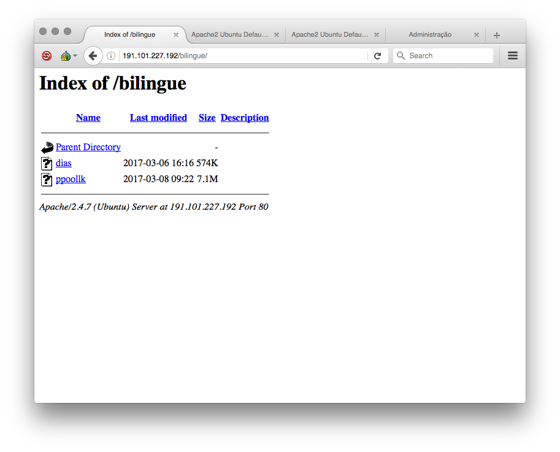

# Malware sample banker FEFAD618EB6177F07826D68A895769A8

This malware sample was identified in Brazil, first identified in 2017-03-14 11:38:41 UTC.

Original URLS

```
http://notificacaododetrans.trade/Notificacao_Infracao_De_Transito_99827462345231.zip 
http://notificacaododetrans.top/Notificacao_Infracao_De_Transito_99827462345231.zip
```

## Decrypt files

Files are stored in base64 encrypted with AES, you can easily decrypt them with

```shell
function decrypt(){
  if [ ! -f "$1" ]
  then
    echo '[-] Can only decrypt files'
  fi
  cat "$1" | base64 -D > "$1".decrypt
  openssl aes-256-cbc -d -in "$1".decrypt -out "$1" -k FEFAD618EB6177F07826D68A895769A8
}
```

To decrypt the files, just run

```
decrypt Notificacao_Infracao_De_Transito_99827462345231.js.b64
mv Notificacao_Infracao_De_Transito_99827462345231.js.b64 \
   Notificacao_Infracao_De_Transito_99827462345231.js
```

## Files

**Identification**

| File                                     | Identification |
| ---------------------------------------- | -------------- |
| Notificacao_Infracao_De_Transito_99827462345231.js | Javascript     |
| HwCyr0Ct.js                              |                |
| aut1CDA.tmp                              |                |
| bin                                      |                |
| damiao.a3x                               |                |
| dias[1]                                  |                |
| docy.exe                                 |                |

**MD5 Hashes**

| File                                     | MD5                              |
| ---------------------------------------- | -------------------------------- |
| Notificacao_Infracao_De_Transito_99827462345231.js | fefad618eb6177f07826d68a895769a8 |
| HwCyr0Ct.js                              | de5e1a3df2bf824c1ba9bcba76049afd |
| aut1CDA.tmp                              | ac6aa9e813de783eaa0f59c7891e6ea5 |
| bin                                      | 94d19f5b3cfa8beeb416456ccfb09bbd |
| damiao.a3x                               | a0c1f1e8e06c623f7861e88e214e9479 |
| dias[1]                                  | 42badc1d2f03a8b1e4875740d3d49336 |
| docy.exe                                 | b06e67f9767e5023892d9698703ad098 |

**SHA-1 Hashes**

| File                                     | SHA                                      |
| ---------------------------------------- | ---------------------------------------- |
| Notificacao_Infracao_De_Transito_99827462345231.js | 427b50ddbaa587abfd96db719110909ce848e361 |
|                                          |                                          |
|                                          |                                          |
|                                          |                                          |
|                                          |                                          |
|                                          |                                          |
|                                          |                                          |

## Virtus Total report

| Ad-Aware                              | JS:Trojan.JS.RWI                       | 20170314 |
| ------------------------------------- | -------------------------------------- | -------- |
| AegisLab                              | Js.Troj.Js!c                           | 20170314 |
| Arcabit                               | JS:Trojan.JS.RWI                       | 20170314 |
| BitDefender                           | JS:Trojan.JS.RWI                       | 20170314 |
| Emsisoft                              | JS:Trojan.JS.RWI (B)                   | 20170314 |
| F-Secure                              | JS:Trojan.JS.RWI                       | 20170314 |
| GData                                 | JS:Trojan.JS.RWI                       | 20170314 |
| Ikarus                                | Win32.Outbreak                         | 20170314 |
| eScan                                 | JS:Trojan.JS.RWI                       | 20170314 |
| NANO-Antivirus                        | Trojan.Script.Heuristic-js.iacgm       | 20170314 |
| Rising                                | Trojan.Agent!8.B1E (cloud:ssQHR0NNF2V) | 20170314 |
| ZoneAlarm by Check Point              | HEUR:Trojan.Script.Agent.gen           | 20170314 |
| AhnLab-V3                             | **                                     | 20170314 |
| Alibaba                               | **                                     | 20170228 |
| ALYac                                 | **                                     | 20170314 |
| Antiy-AVL                             | **                                     | 20170314 |
| Avast                                 | **                                     | 20170314 |
| AVG                                   | **                                     | 20170314 |
| Avira (no cloud)                      | **                                     | 20170314 |
| AVware                                | **                                     | 20170314 |
| Bkav                                  | **                                     | 20170313 |
| CAT-QuickHeal                         | **                                     | 20170314 |
| ClamAV                                | **                                     | 20170314 |
| CMC                                   | **                                     | 20170314 |
| Comodo                                | **                                     | 20170314 |
| CrowdStrike Falcon (ML)               | **                                     | 20170130 |
| Cyren                                 | **                                     | 20170314 |
| DrWeb                                 | **                                     | 20170314 |
| Endgame                               | **                                     | 20170222 |
| ESET-NOD32                            | **                                     | 20170314 |
| F-Prot                                | **                                     | 20170314 |
| Fortinet                              | **                                     | 20170314 |
| Invincea                              | **                                     | 20170203 |
| Jiangmin                              | **                                     | 20170314 |
| K7AntiVirus                           | **                                     | 20170314 |
| K7GW                                  | **                                     | 20170314 |
| Kaspersky                             | **                                     | 20170314 |
| Kingsoft                              | **                                     | 20170314 |
| Malwarebytes                          | **                                     | 20170314 |
| McAfee                                | **                                     | 20170314 |
| McAfee-GW-Edition                     | **                                     | 20170314 |
| Microsoft                             | **                                     | 20170314 |
| nProtect                              | **                                     | 20170314 |
| Palo Alto Networks (Known Signatures) | **                                     | 20170314 |
| Panda                                 | **                                     | 20170313 |
| Qihoo-360                             | **                                     | 20170314 |
| Sophos                                | **                                     | 20170314 |
| SUPERAntiSpyware                      | **                                     | 20170314 |
| Symantec                              | **                                     | 20170313 |
| Tencent                               | **                                     | 20170314 |
| TheHacker                             | **                                     | 20170311 |
| TrendMicro                            | **                                     | 20170314 |
| TrendMicro-HouseCall                  | **                                     | 20170314 |
| Trustlook                             | **                                     | 20170314 |
| VBA32                                 | **                                     | 20170313 |
| VIPRE                                 | **                                     | 20170314 |
| ViRobot                               | **                                     | 20170314 |
| Webroot                               | **                                     | 20170314 |
| WhiteArmor                            | **                                     | 20170303 |
| Yandex                                | **                                     | 20170312 |
| Zillya                                | **                                     | 20170313 |
| Zoner                                 | **                                     | 20170314 |


## Network access and contacted ip addresses

The sample contacted two IP addresses **191.101.227.192** and **191.101.236.137**.

| IP              | Port | Location                          |
| --------------- | ---- | --------------------------------- |
| 191.101.227.192 | 80   | Chile (ASN: 12586 (GHOSTnet GmbH) |
| 191.101.236.137 | 80   | Chile (ASN: 12586 (GHOSTnet GmbH) |

Three HTTP requests were made

* (GET) 191.101.227.192/bilingue/ppoollk
* (GET) 191.101.227.192/bilingue/dias
* (POST) 191.101.236.137/number/post.php

The index page on each IP address look like the default page for an Apache2 running on an Ubuntu system


And

Giving a look to the url **/bilingue** on 191.101.227.192, there was a directory listen enabled, with 2 files



Inspecting the other IP, 191.101.236.137, on the URL **/number/** aparently we got an loguin panel


Nmap Scan those hosts result in

```
# nmap -sS -sV  -T 5 191.101.227.192 191.101.236.137                                                                                                                                                                                                                               

Starting Nmap 6.47 ( http://nmap.org ) at 2017-03-14 20:54 UTC
Nmap scan report for 191.101.227.192
Host is up (0.073s latency).
Not shown: 997 closed ports
PORT   STATE SERVICE VERSION
22/tcp open  ssh     (protocol 2.0)
25/tcp open  smtp    Postfix smtpd
80/tcp open  http    Apache httpd 2.4.7 ((Ubuntu))
1 service unrecognized despite returning data. If you know the service/version, please submit the following fingerprint at http://www.insecure.org/cgi-bin/servicefp-submit.cgi :
SF-Port22-TCP:V=6.47%I=7%D=3/14%Time=58C858A1%P=x86_64-pc-linux-gnu%r(NULL
SF:,29,"SSH-2\.0-OpenSSH_6\.6\.1p1\x20Ubuntu-2ubuntu2\r\n");
Service Info: Host:  UNKNOWN

Nmap scan report for 191.101.236.137
Host is up (0.073s latency).
Not shown: 997 closed ports
PORT   STATE SERVICE VERSION
22/tcp open  ssh?
25/tcp open  smtp    Postfix smtpd
80/tcp open  http    Apache httpd 2.4.7 ((Ubuntu))
Service Info: Host:  UNKNOWN

```